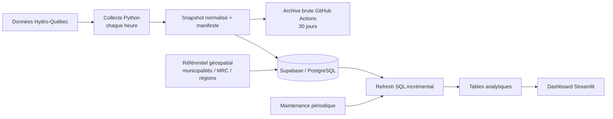

# ProjetHydro

Pipeline automatisé de collecte, d'historisation et d'analyse des pannes électriques au Québec, accompagné d'un dashboard Streamlit interactif.

Le projet collecte les données publiques d'Hydro-Québec **chaque heure** avec GitHub Actions, conserve l'historique de production dans **Supabase/PostgreSQL**, maintient des tables analytiques optimisées et expose les résultats dans un dashboard permettant d'explorer les pannes actives et historiques.

> L'historique du projet débute le **31 mars 2026**.

## Architecture



### Pipeline de production

1. `scripts/fetch_outages.py` récupère le snapshot courant, normalise les champs, classe les causes et crée un `snapshot_id` unique. Le manifeste `current_snapshot_meta.json` permet de représenter explicitement un snapshot valide contenant **0 panne**.
2. `.github/workflows/hydro.yml` exécute la collecte **toutes les heures**.
3. `scripts/archive_snapshot.py` compresse le snapshot, calcule ses checksums SHA-256 et `.github/workflows/hydro.yml` le conserve comme **artifact GitHub Actions pendant 30 jours avant toute tentative de synchro Supabase**.
4. `scripts/sync_to_supabase.py` synchronise le snapshot vers `raw_outage_snapshots` et journalise son état dans `collection_runs`. La migration des anciennes observations vers des identifiants `legacy:*` est automatique et idempotente.
5. `scripts/refresh_supabase_analytics.py` met à jour de façon incrémentale les tables utilisées par l'application. Les pannes actives correspondent exactement au **dernier snapshot réussi**, sans fenêtre temporelle approximative.
6. `dashboard/streamlit_app.py` interroge directement les tables PostgreSQL lorsque la connexion Supabase est configurée.
7. `.github/workflows/hydro_maintenance.yml` effectue une maintenance hebdomadaire et force la réconciliation des analyses plus coûteuses.

## Tables principales

| Table | Rôle |
| --- | --- |
| `collection_runs` | Journal des snapshots : identifiant, heure, version source, statut et nombre de pannes |
| `raw_outage_snapshots` | Historique brut des observations de pannes, reliées à un `snapshot_id` |
| `dim_municipalities` | Référentiel municipal enrichi avec MRC et région |
| `app_latest_outages` | Dernière observation connue de chaque panne |
| `app_active_outages` | Pannes considérées actives au dernier snapshot |
| `app_daily_summary` | Agrégations quotidiennes utilisées pour les tendances |
| `app_data_quality_report` | Contrôles et indicateurs de qualité des données |

Les tables `app_latest_outages` et `app_active_outages` sont maintenues de façon incrémentale afin d'éviter de retraiter l'ensemble de l'historique à chaque collecte. Les analyses plus lourdes, notamment les agrégations quotidiennes et le rapport de qualité, sont rafraîchies périodiquement et peuvent être reconstruites lors de la maintenance.

## Convention des fuseaux horaires

Le pipeline utilise maintenant des timestamps PostgreSQL `TIMESTAMPTZ` et applique explicitement les conventions suivantes :

- `captured_at` est généré par ProjetHydro en **UTC** ;
- `start_time` et `estimated_restore` fournis sans offset par Hydro-Québec sont interprétés comme des heures locales `America/Toronto`, puis convertis en UTC pour le stockage ;
- le dashboard reconvertit les horodatages dans `America/Toronto` pour l'affichage ;
- `app_daily_summary` utilise la **date civile du Québec**, et non la date UTC, pour classer une capture dans une journée.

La migration des anciennes colonnes `TIMESTAMP` vers `TIMESTAMPTZ` est automatique et idempotente. Lors du premier refresh après migration, `app_latest_outages` est reconstruit afin de recalculer les durées avec les timestamps corrigés.

## Sauvegarde et reprise d'un snapshot

Le workflow horaire crée une archive `csv.gz` avant la synchro Supabase puis l'envoie dans les artifacts du run GitHub Actions. Chaque manifeste contient le `snapshot_id`, le nombre de pannes et des checksums SHA-256. La rétention est configurée à **30 jours**.

Si une synchro Supabase échoue après une collecte réussie :

1. télécharger l'artifact `hydro-raw-<run_id>-<attempt>` du run concerné ;
2. extraire l'artifact ;
3. restaurer le snapshot à partir de son manifeste JSON :

```bash
python scripts/restore_snapshot_archive.py chemin/vers/le_manifeste.json
```

4. relancer la synchro normale :

```bash
python scripts/sync_to_supabase.py
python scripts/refresh_supabase_analytics.py
```

Les contraintes d'unicité et `snapshot_id` rendent ce rejeu idempotent.

## Enrichissement géospatial

Les observations Hydro-Québec fournissent un identifiant municipal et des coordonnées. Le script `scripts/build_municipality_reference_geo.py` permet de construire un référentiel en associant ces points à des polygones municipaux, puis d'ajouter notamment :

- le nom de la municipalité ;
- la MRC ;
- la région administrative ;
- des indicateurs de couverture et de qualité du géocodage.

Ce référentiel est ensuite synchronisé vers `dim_municipalities` et utilisé par les analyses et les cartes du dashboard.

## Dashboard

Le dashboard Streamlit permet notamment de consulter :

- les pannes actives et le nombre de clients touchés ;
- les pannes récentes et l'historique disponible ;
- les cartes par municipalité, MRC et région ;
- l'évolution temporelle des pannes et des clients affectés ;
- la distribution des causes ;
- les indicateurs de qualité des données.

En production, le dashboard lit les données dans Supabase/PostgreSQL. Pour le développement local, il peut également utiliser les exports CSV générés à partir du warehouse DuckDB.

## Workflow local avec DuckDB

DuckDB reste disponible comme environnement analytique local et reproductible.

```bash
# Installer les dépendances
python -m pip install -r requirements.txt

# Collecter un snapshot et l'ajouter à l'historique CSV local
HYDRO_WRITE_LOCAL_HISTORY=1 python scripts/fetch_outages.py

# Construire le warehouse local
python scripts/build_warehouse.py

# Exporter les tables analytiques en CSV
python scripts/export_tables.py

# Lancer le dashboard
streamlit run dashboard/streamlit_app.py
```

Sous Windows PowerShell, la variable d'environnement peut être définie avant la collecte avec :

```powershell
$env:HYDRO_WRITE_LOCAL_HISTORY="1"
python scripts/fetch_outages.py
```

## Configuration Supabase

La connexion de production utilise principalement les variables suivantes :

```text
SUPABASE_DB_URL
SUPABASE_DB_HOSTADDR   # optionnelle selon l'environnement réseau
```

Le dashboard peut aussi recevoir ces valeurs via les secrets Streamlit. Les identifiants de connexion ne doivent jamais être ajoutés au dépôt Git.

## Structure du projet

```text
ProjetHydro/
├── .github/workflows/              # CI, automatisation horaire et maintenance
├── dashboard/
│   └── streamlit_app.py            # Application Streamlit
├── scripts/
│   ├── fetch_outages.py            # Collecte, retries HTTP et normalisation
│   ├── archive_snapshot.py         # Archive brute + checksums
│   ├── restore_snapshot_archive.py # Restauration/rejeu d'un artifact
│   ├── time_utils.py               # Conventions UTC / America/Toronto
│   ├── sync_to_supabase.py         # Synchronisation PostgreSQL
│   ├── refresh_supabase_analytics.py
│   ├── build_warehouse.py          # Workflow DuckDB local
│   ├── export_tables.py
│   └── build_municipality_reference_geo.py
├── sql/                            # Transformations du warehouse DuckDB
├── supabase/                       # Schéma et optimisation PostgreSQL
├── tests/                          # Tests automatisés
└── requirements.txt
```

## Technologies

**Python · pandas · PostgreSQL · Supabase · SQL · Streamlit · Plotly · GitHub Actions · DuckDB · données géospatiales · ETL · Data Quality**

## Qualité et exploitation

Le pipeline comprend plusieurs mécanismes destinés à rendre les traitements plus robustes :

- snapshots atomiques identifiés par `snapshot_id`, y compris lorsqu'aucune panne n'est active ;
- journal `collection_runs` avec statuts `pending`, `success` et `error` ;
- déduplication des observations par panne et timestamp de capture ;
- archive brute de chaque collecte avant la synchro Supabase, conservée 30 jours dans GitHub Actions ;
- restauration contrôlée d'un snapshot archivé avec vérification SHA-256 ;
- synchronisation avec une petite fenêtre de reprise pour récupérer d'éventuelles arrivées tardives ;
- sessions HTTP avec retries, backoff exponentiel et gestion des statuts `429/500/502/503/504` ;
- stockage `TIMESTAMPTZ` avec séparation explicite UTC / heure locale du Québec ;
- rafraîchissement incrémental des tables les plus consultées ;
- index PostgreSQL pour les accès fréquents ;
- rapport de qualité des données ;
- maintenance périodique pour réconcilier les tables analytiques ;
- CI GitHub Actions exécutant la compilation Python et `pytest` sur les pushes et pull requests.

## Licence et source des données

Les données utilisées dans ce projet proviennent des données publiques d'Hydro-Québec.

Elles sont distribuées sous licence **Creative Commons Attribution – NonCommercial 4.0 International (CC BY-NC 4.0)**. Elles doivent notamment être attribuées à leur source et ne doivent pas être utilisées à des fins commerciales.

- Source : Hydro-Québec – Données ouvertes : https://donnees.hydroquebec.com/explore/dataset/pannes-interruptions/information/?flg=fr-fr
- Licence : CC BY-NC 4.0
- Texte de la licence : https://creativecommons.org/licenses/by-nc/4.0/

Les traitements réalisés dans ce dépôt peuvent inclure la collecte, le nettoyage, la transformation, l'agrégation et l'analyse des données. Toute erreur d'interprétation ou d'analyse relève de l'auteur de ce projet et non d'Hydro-Québec.
